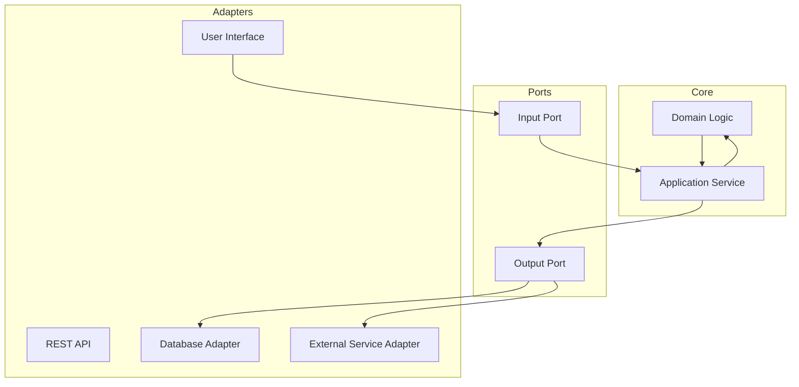
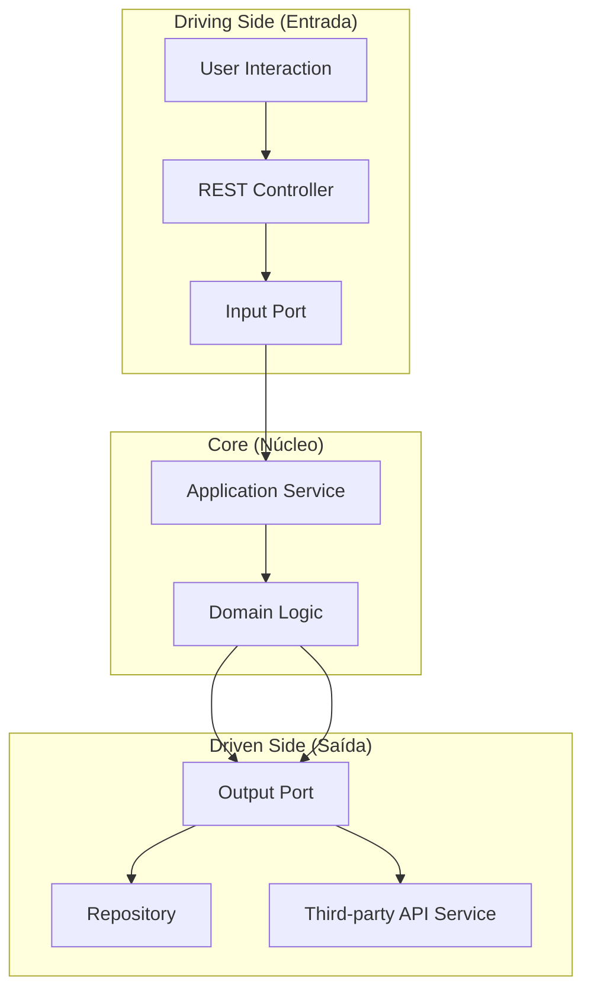
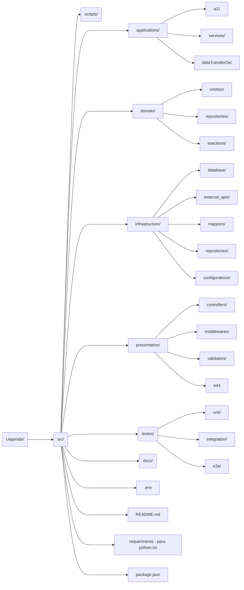
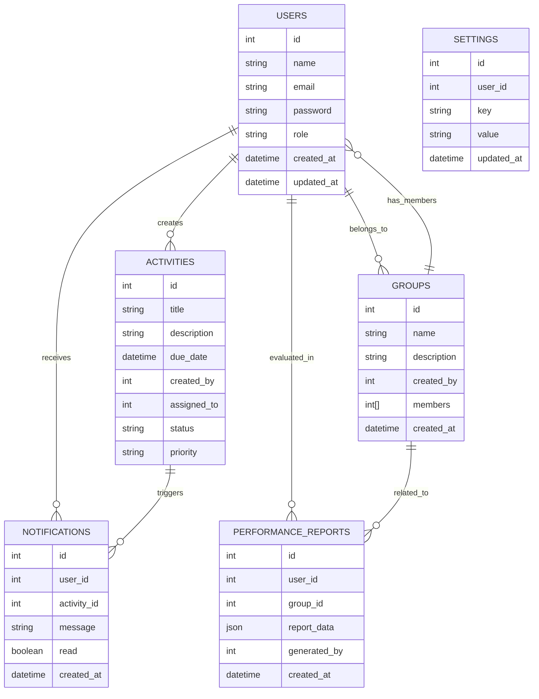

# **UAgenda**

Desenvolvida pela Uclass, a UAgenda é uma ferramenta pensada em solucionar o problema da incosistência de rotina acadêmica que afeta diretamente o desempenho escolar e atrapalha o desenvolvimento das nossas crianças. 

## O que é UAGENDA?

È uma agenda escolar. Porém é desenvolvida por professionais que atuam diretamente o ambiente escolar e com o público alvo, os estudantes. A UAgenda é pensada na praticidade, interface minimalista e aplicablidade consicisa com a rotina de sala. Evitamos recursos que desnecessários e temos como primazia o conceito "fewest clicks possible" ou menos cliques possíveis. UAgenda que é balizada principalmente na experiência do usuário.

## Funcionalidades

 - Criação de atividades e tarefas com data e prazos;
 - Notificações e lembretes em tempo real;
 - Sincronização de dados entre dispositivos;
 - Chat Pais escola;
 - Lembrete professor aluno específico;
 - Acompanhamento para pessoas PcDs;
 - Visualização de Calendário Acadêmico;
 - Configuração de prioridade para atividades;
 - Acompanhamento de notas e avaliações;]
 - Integração com outras Plataformas(Google Calendar);
 - Timer Pomodoro;

 ## Tecnologias utilizadas
 ### Mobile
 - flutter;
 ### BackEnd
 - Node.js
 ### Banco de Dados
 - Postgresql;

 ### API Diagrama
A arquitetura **Hexagonal Architecture** (também conhecida como **Ports and Adapters**) é um estilo de design que visa desacoplar os componentes centrais da aplicação (lógica de negócios) dos detalhes externos, como frameworks, bancos de dados ou APIs externas. Isso facilita a testabilidade, manutenção e escalabilidade.

### **Descrição dos Elementos**

#### **Core (Núcleo da Aplicação)**
1. **Domain Logic**:
   - Contém as regras de negócios e entidades principais da aplicação.
   - É o coração do sistema, completamente independente de frameworks ou tecnologias externas.
   - Exemplo: Entidades como `Task`, `User`, ou lógica como "verificar se uma tarefa está atrasada".

2. **Application Service**:
   - Medeia a comunicação entre os **Ports** e o **Domain**.
   - Implementa casos de uso específicos do sistema.
   - Exemplo: "Criar uma tarefa", "Marcar uma tarefa como concluída".

#### **Ports**
1. **Input Port**:
   - Define interfaces que descrevem **como** a aplicação recebe dados e comandos externos.
   - É implementado pelos adaptadores de entrada (como controllers REST ou interfaces de usuário).
   - Exemplo: Um método como `createTask(task: Task): Response`.

2. **Output Port**:
   - Define interfaces para comunicação com sistemas externos, como bancos de dados, APIs externas ou serviços de notificação.
   - O Core nunca conhece os detalhes de implementação desses adaptadores; ele apenas usa essas interfaces.
   - Exemplo: Um método como `saveTask(task: Task)` ou `notifyUser(userId: String)`.

#### **Adapters**
1. **User Interface (UI)**:
   - Pode ser uma interface gráfica, aplicação mobile ou uma interface de linha de comando.
   - É responsável por interagir com os **Input Ports** para enviar dados para o Core.

2. **REST API**:
   - Atua como um ponto de entrada para consumidores externos (como o front-end).
   - Traduz requisições HTTP em chamadas para os **Input Ports**.

3. **Database Adapter**:
   - Implementa as interfaces definidas nos **Output Ports** para persistir dados.
   - Pode usar bibliotecas como `SQLAlchemy`, `Mongoose` ou `Prisma`.

4. **External Service Adapter**:
   - Implementa as interfaces definidas nos **Output Ports** para interagir com APIs ou serviços externos.
   - Exemplo: Enviar notificações via um serviço como Firebase ou consumir uma API externa.

---

### Estrutura da API
1. Driving Side (Entrada):

* User Interaction: Representa o ponto inicial das interações, como um cliente ou usuário.
* REST Controller: Traduz as requisições para chamadas nos ports de entrada.
* Input Port: Define a interface usada pelo núcleo para receber comandos.

2. Core (Núcleo):
* Application Service: Orquestra chamadas entre o domínio e os ports.
* Domain Logic: Contém as regras de negócios centrais.

3. Driven Side (Saída):
* Output Port: Interface para comunicação com sistemas externos.
* Database Adapter: Implementação do repositório.
* External API Adapter: Implementação de chamadas para serviços externos.

## Estrutura Organizacional da API.

1. application/:
- Contém os serviços de aplicação que orquestram as operações de alto nível.
- Os DTOs garantem a separação entre as camadas.
2. domain/:
- O núcleo do sistema, com regras de negócios, entidades, e interfaces para persistência.
3. infrastructure/:
- Implementações de repositórios, integração com bancos de dados e APIs externas.
- Contém código dependente de frameworks e infraestrutura.
presentation/:

4. Responsável por interagir com o usuário ou cliente (controladores REST, validações de entrada).
5. tests/:
- Separado por tipo de teste para facilitar a manutenção e a rastreabilidade.

```mermaid
architecture-beta
    group api(logos:npm)[API Uagenda]


```

## Banco de Dados Diagrama

Segue o diagrama de relacionamento em formato **Mermaid**, que pode ser usado diretamente no seu README:

---

### Explicação dos Relacionamentos
1. **USERS → ACTIVITIES**: Um usuário pode criar várias atividades (`created_by`) e também pode ser designado a elas (`assigned_to`).
2. **USERS → NOTIFICATIONS**: Um usuário pode receber várias notificações relacionadas às suas atividades.
3. **USERS → PERFORMANCE_REPORTS**: Um usuário pode ser avaliado ou gerar relatórios de desempenho.
4. **USERS → GROUPS**: Usuários podem pertencer a um ou mais grupos/turmas.
5. **ACTIVITIES → NOTIFICATIONS**: Cada atividade pode gerar notificações para seus participantes.
6. **GROUPS → PERFORMANCE_REPORTS**: Relatórios de desempenho podem ser relacionados a grupos específicos.
7. **GROUPS → USERS**: Cada grupo tem uma lista de membros (usuários). 

